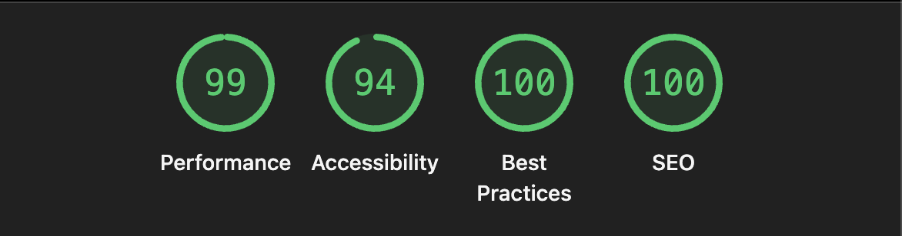

# What is this?

A GitHub profile dashboard built with Next.js 16.2 and TypeScript. It displays real GitHub data including: profiles, repositories, activity, and contribution history and is secured with GitHub OAuth. It is deployed on Render with Docker.

## Live demo: https://troys-git-dashboard.onrender.com

## What was shipped?

All pages have dynamic metadata for SEO. There is a favicon.

- **Landing page**: public landing page located at /
- **GitHub OAuth**: secure login via Auth.js GitHub provider
- **Authenticated dashboard**: avatar, name, bio, follower/following counts, public repo count are fetched and displayed.
- **Top 6 repositories**: retrieves and displays: name, description, star count, language, last updated
- **Recent activity feed**: last 10 events with option to view more.
- **Contribution calendar**: displayed on dashboard/[username] route
- **Dark mode**: system-preference aware, toggleable
- **Fully responsive UI**

## Tech Stack and Methodology

- **Framework**: NEXTJS, used for frontend, middleware and state management. API calls with "use server:.
- **Styling**: ShadCN component library and Tailwind v4.
- **Version Control**: GIT flow methodology was used, created dedicated feature branches and merged after a Peer review.
- **CI**: Every commit and merge went through a CI pipeline, which build, linted and type checked the project to prevent breaking changes and ensure high code quality.

## Getting Started

### Prerequisites

- Node.js 22+
- Bun
- Docker (for containerised deployment)
- A GitHub OAuth App (see below)

### 1. Clone and install

```bash
git clone https://github.com/Graduate-Program-26/React-Assessment-Troy.git
cd react-assessment-troy
bun install
```

### 2. Create a GitHub OAuth App

1. Go to [GitHub Developer Settings](https://github.com/settings/developers)
2. Click **New OAuth App**
3. Set **Homepage URL** to `http://localhost:3000` OR deployed URL
4. Set **Authorization callback URL** to `http://localhost:3000/api/auth/callback/github` or `http://deployedURL/api/auth/callback/github`
5. Copy the **Client ID** and generate a **Client Secret**

### 3. Environment variables

Generate `AUTH_SECRET` for next-auth:

```bash
openssl rand -base64 32
```

```env
GITHUB_CLIENT_ID=your_client_id
GITHUB_CLIENT_SECRET=your_client_secret
AUTH_SECRET=your_random_secret_min_32_chars
NEXTAUTH_URL=http://localhost:3000
```

### 4. Run locally

```bash
bun dev
```

Open [http://localhost:3000](http://localhost:3000).

## Custom Hooks

Reusable logic is extracted into custom hooks to keep components focused on rendering.

**useClickOutside**: Detects click events outside of an element, I use this to close the search results when somewhere else is clicked.

**useDebounce**: Generic debounce logic, used in the search feature.

**use-github-search**: The functionality to search github, this was extracted so that it could be used in multiple components easilly in the future.

**use-recent-searches**: Controls logic for storing and accessing the recent searches it's used int he sidebar and in the search function.

## GitHub API

All API calls are server-side only. No token is ever exposed to the client.

## Authentication

Auth is handled by AuthJS using the github provider.

- `/dashboard` is a protected route. Unauthenticated users are redirected to `/login`
- Session is managed entirely server-side `auth()` in Server Components
- The OAuth access token is used server-side to fetch authenticated GitHub data

## Lighthouse Score

A11y plugin was isntalled for es-lint, so the CI pipeline caught Accessibility issues before they were deployed. They were easilly fixed.

- Semantic HTML throughout (`nav`, `main`, `article`, `section`, `header`, `footer`)
- All images include descriptive `alt` text
- ARIA labels on icon-only buttons

## 

- Performance: 99
- Accessibility: 94
- Best Practices: 100
- SEO: 100

## Deployment

Deployed on Render using Docker.

### Run with Docker locally

```bash
docker build -t react-assessment-troy .
docker run -p 3000:3000 --env-file .env react-assessment-troy
```

### Render setup

1. Push the repo to GitHub
2. Create a new **Web Service** on [Render](https://render.com) and connect the repo
3. Set **Environment** to `Docker`
4. Add the environment variables from `.env` in the Render dashboard
5. Update your GitHub OAuth App's callback URL to your Render domain:
   `https://deployedURL.onrender.com/api/auth/callback/github`

## Git Workflow

- Feature branches off `main` — e.g. `feature/oauth`
- Pull Requests reviewed by a peer before merge
- Commits are atomic and appropriately scoped
- No broken or partial commits on any branch

## Scripts

```bash
bun dev
bun build
bun start
bun lint
bun typecheck
```
